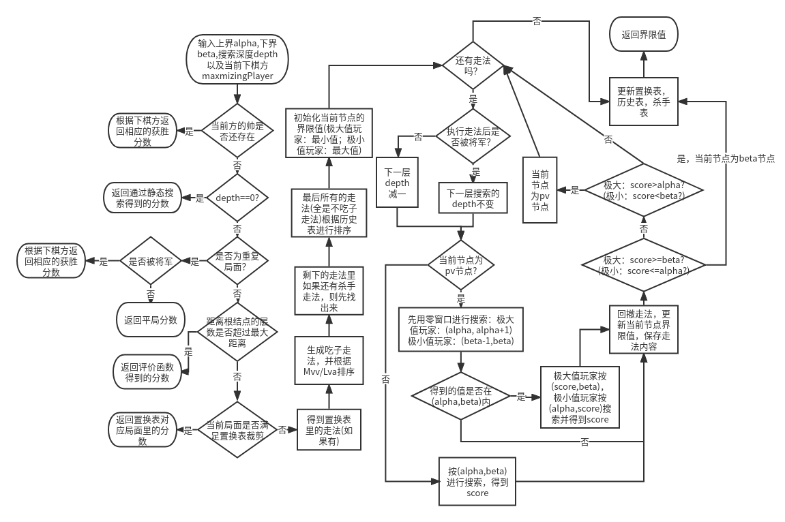

# 中国象棋人机对弈网站

## 食用方法

在当前文件夹下打开终端，输入`python3 -m serv/`可以在本地运行一个服务器，然后在浏览器上输入并打开网址127.0.0.1:8000，就可以下棋了。红方为玩家，黑方为电脑。

电脑默认的搜索时间为8秒（一般会严重超过这个时间），如果嫌下棋速度太慢，可以在web/py_lib/auto_chess2.py文件夹里找到auto_move函数，找到`board_explore = BoardExplore(board, 8)`，这里的第二个值“8”就是搜索时间，单位是秒。一般来说，搜索时间越长电脑越“聪明”（至少要搜索五步才不会那么傻，搜索六步才会比较聪明）。搜索时间为8秒（实际为十几秒）时程序的棋力略大于中级难度的电脑。

## BUG(Feature)

------

1. 由于置换表和历史表里的项太多(在每次开局双方走子后才会清空)，运行时内存占用巨大(3-4GB，偶尔可能会突破5GB)；
2. 运行速度太慢，如果搜索六步要大概花费几十秒的时间(五步一般也要七八秒到十几秒)；
3. 残局时由于将军延伸导致每步的搜索往往都要到最大搜索深度，因此有些情况下的搜索时间非常长（可能有3-4分钟）。
3. 残局时如果搜索不超过六步，很有可能会走出长将的走法

## 参考文献

------

象棋巫师：https://www.xqbase.com/computer.htm

象棋wiki(Chess Programming wiki)：https://www.chessprogramming.org/Main_Page

np问题：http://www.matrix67.com/blog/archives/105

## 搜索方法

______
alphabeta剪枝法：

- wiki(没有使用负值传递)：https://en.wikipedia.org/wiki/Alpha%E2%80%93beta_pruning

pvs(主要変例搜索，alphabeta的变种)法：

- [建议看这个]象棋wiki(使用了负值传递的方法): https://www.chessprogramming.org/Principal_Variation_Search 
- CSDN(没有使用负值传递): https://blog.csdn.net/u012501320/article/details/25081933
- 象棋巫师(使用了负值传递)：https://www.xqbase.com/computer/advanced_pvs.htm

蒙特卡洛搜索树：

- 知乎：https://zhuanlan.zhihu.com/p/333348915
- B站视频：https://www.bilibili.com/video/BV1fY4y1876L/?spm_id_from=333.788.recommend_more_video.-1

评估函数的设计：https://www.xqbase.com/computer/evalue_intro1.htm

置换表：https://www.xqbase.com/computer/search_hashing.htm

置换表中胜利条件的设置：https://www.xqbase.com/computer/other_winning.htm

## 对下法进行排序

_____
由于alpha-beta，pvs等搜索方法要求比较好的着法的顺序(即前几个着法就可以得到本节点的界限值)，因此需要对着法进行排序。着法排序的方式也称为启发式。

静态启发搜索：吃子的着法大概率比不吃子的好，这里使用Mvv/Lva(最有价值受害者/最小没价值攻击者，Most Valuable Victim/Least Valuable Attacker)的评估方法对所有吃子着法进行评估。评估方法是：如果被吃的棋子没有被保护，那么该走法的分数是被吃的棋子子力值；如果被吃的棋子有被保护，那么分数就为被吃的棋子子力值减去移动的棋子子力值。在我的程序里，棋子的子力值包括了棋子的固定子力值和位置值，具体可以看sortCapMove函数。

动态启发搜索：    
1. 使用置换表：置换表的键是棋盘的局面和下棋方，值是当前局面下之前搜索得到的最优着法以及搜索深度(当前节点还要继续搜索的深度，也称步数)，以及当前得到的分数值以及节点性质(是alpha，beta还是pv节点)。**注意**，如果分数是胜利分数，存入置换表和从置换表里取出分数是需要进行修改的。采用了置换表之后，不仅可以得到比较好的下法，同时可以利用它进行裁剪，不过会导致[不稳定性](https://www.xqbase.com/computer/search_hashing.htm)。
2. 使用杀手走法：保留兄弟节点(到达根结点的深度一致)的最优着法，这里同一层的我们只存处两个。
3. 使用历史表：历史表里只存储了每种情况下的最好着法，值是得到这个着法时的节点的搜索深度的平方。并且每次迭代加深搜索后历史表中的值会变为四分之一。

## 避免水平线效应

_____
如果搜索深度是固定的，那么到达搜索深度后进行评分往往得不到准确的值，甚至有可能会得到错误的分数。例如搜索到最后一层时，假如此时有被将军或者其他棋子有被抓到的情况，此时对棋盘进行评分会得到一个错误的值（评分只统计局面上棋子的子力之和）。这种情况被称为水平线效应。为了避免这种情况，一般会用几种方法让搜索深度动态变化（使搜索变得更深）。

1. 将军延伸：每次得到下法后，都会检查下棋方是否被将军，如果被将军，就会让搜索增加一层。
2. 静态搜索：当搜索深度为0后，进入静态搜索。静态搜索首先判断是否被将军。如果被将军，就生成所有的下法；如果没有被将军，就先进行评分看看能否截断，然后再按Mvv/Lva的顺序生成所有吃子的下法。然后再对每一种下法进行搜索。
3. 空着前向搜索

由于将军延伸和静态搜索在长将解将时会永远搜索下去，因此需要引入重复局面判断和最大搜索深度的限制。

## 算法流程图

------

### pvs搜索算法流程图（部分操作没有详细说明）

 	 

### 置换表裁剪以及更新置换表的操作

 	 

### 静态搜索（其中对于被将军之后的处理方法与其他方法不同）

 	 

### 迭代加深搜索

 	 

## 一些细节

------

### 算法里的几种深度的说明

|          名称/属性           |                             含义                             |        使用该深度的模块        |
| :--------------------------: | :----------------------------------------------------------: | :----------------------------: |
|         **搜索深度**         |             还要往下搜索的深度，也可以称为步数。             | pvs，静态搜索，置换表，历史表  |
| **距离根节点的距离（深度）** | 每次执行走法后，距离根结点的距离（深度）加一；每次撤回走法后，距离根结点的距离减一。 | 评价函数，分数修正，杀手走法表 |
|         **将军深度**         | 记录由于将军延伸导致的搜索深度的变化，每次将军延伸则加一，结束将军延伸后减一。 |               无               |

### 分数分布和处理

这里我们假设分数总范围为[-10000, 10000]，那么就有以下的分布情况。

 	 

将胜利分数这么划分的原因是：

1. 走了一步和走了六步后胜利是不一样的，走了一步后取得的胜利一定好于走了六步以后的胜利。因此即使是胜利，也有好坏只分。
2. 长将获得的胜利和非长将获得的胜利也是不一样的。一般来说，**长将获得的胜利不如非长将的**。因为正常来说，对手是不会按照长将的走法走。

因此我们可以总结出，浅层搜索得到的胜利要比从深层搜索里得到的胜利好，非长将胜利要比长将胜利好。

因此，对于胜利分数，我们需要进行分数修正。

1. 对于未修改的原始胜利分数（假设是极大值方的），我们将其减去距离根结点的深度值（如果是极小值方就加上）。这样就能使浅层搜索得到的胜利分数大于从深层搜索得到的胜利分数。
2. 对于长将的胜利分数，修改完分数后我们再给它减去一个固定值（极小值方的就加上），使其一定不好于非长将情况的胜利。

代码里的WIN_VALUE=9800即为极大值方胜利分数的下界，BAN_VALUE=9900即为长将分数的上界，取反就是极小值方相应的界限。

对于平局分数，可以看这篇文章里的内容：https://www.xqbase.com/computer/other_contempt.htm

**置换表的分数修正**：当使用置换表裁剪时，对于一个胜利分数，由于取出信息的时候，当前节点距离根结点的深度大概率是**不等于**置换表里节点距离根结点的深度的，如果还使用存入置换表里的已经做过处理的分数，那么肯定是有误的。因此当胜利分数存入置换表时，分数要加回存入时节点距离根结点的深度（极小值方就减去）。取出时，对于胜利分数，要减去取出时节点距离根结点的深度（极小值方要加上）。

**注**：如果根结点也使用了置换表裁剪，那么是有可能得到10000和-10000分数的（置换表里有根结点局面的信息，并且是胜利分数，且迭代加深还处于比较浅的时候）。

### 节点类型

在使用置换表裁剪时，要根据表中记录的节点类型，决定是否能够使用裁剪。一共有三种类型的节点，alpha，beta和pv节点。对于极大值方玩家来说，alpha节点是指其分数不会超过所记录的分数，beta节点是指其分数不会低于所记录的分数，而pv节点则是指其分数刚好为所记录的分数。极小值方玩家的alpha节点是不会低于所记录的分数，beta节点是指其不会超过所记录的分数。

以下均以极大值方的视角阐述三种节点是如何在搜索过程中找到的。在alphabeta或者pvs搜索中，只要其某一个子节点的分数**不小于**规定的beta上界，那么此节点就为beta节点；搜索完所有子节点，如果得到的最大分数依然**不大于**alpha下界，那么这个节点就是alpha节点，而如果得到的最大分数在(alpha, beta)（注意是开区间）中，那么这个节点就是pv节点。

相应的，每一种类型节点的下法也有不同的保存情况，一般来说，只有beta节点和pv节点的节点会统计最好下法。这是因为对于极大值方，只有提高下界或者稳定的下法才有意义。相应的，对于极小值方只有降低上界和稳定的下法才有意义。beta节点的下法就是一种会提高下界（极大值方）或降低下界（极小值方）的下法。pv节点的下法是一种稳定得分的下法。而对于alpha节点，我根据“象棋巫师”网站的说法，也保存进了置换表中，搜索深度为0（见置换表更新的算法流程图）。这样除非alpha节点的分数是非长将的胜利分数，否则不会参与置换裁剪，当时它能提供一个不错的下法。

### 搜索法

有些资料（wiki）里，alphabeta搜索可以看到有两种变型，一种是fail hard，即只会返回不超过beta值（极大值方）或alpha值（极小值方）的分数；一种是fail soft，会返回超过beta或alpha值的分数。这里我倾向于用fali soft方案。因为后面的置换表需要一些更加精确的值，因此还是fail soft好。

此外，这里要说明一个情况，即如果有几个走法得到了相同的分数，那么最早得到的那个下法一定是最好的。

 	 

图中绿色正方形为极大值方节点，蓝色圆形为极小值方节点。对于节点B，已经得到了一个子节点A的分数，因此确定了取值范围为[0, +∞]。此时对于子节点C，当它搜索到子节点D时，发现分数刚好等于0，那么此时C节点就触发了beta截断，成为了一个beta节点。这里我们可以看出，虽然A和C节点返回的分数都是一样的，但是由于C节点是个beta节点，它可能有更坏的情况。**而对于A节点，其搜索时取值范围肯定是不小于C，所以A返回的分数更有可能接近精确值，因此越早搜索得到的下法，一定是更好的。**

### 静态搜索的一些改进

1. 对于所有吃子走法，根据“象棋巫师”网站的说法，可以不采用吃没过河的兵，士以及象的走法。但是我发现如果残局的时候不考虑吃士和象，好像比较容易导致搜索出现不稳定（简称走臭棋，即返回的分数不太准确）。那么如果吃其他子的走法数量不大于1，我就会加上吃士和象的走法。
2. 对于被将军的情况，我发现如果生成所有下法然后继续调用静态搜索的话，搜索速度会非常慢（可能是我实现的地方有问题）。因此我退而求其次，当被将军后，只搜索走后不会再被将军的走法，并且走完后就利用评估函数返回局面分数。这样做看起来好像没什么问题。

### 评估函数

这里我直接套用了“象棋巫师”的子力数组。同时我发现电脑下棋比较喜欢下“窝心马”，因此我单独给出现窝心马的情况扣了分。

## TODO(咕)

------

1. 评价函数可能还是比较简陋，可以再复杂一点（不过再复杂一点搜索速度会更慢）。
2. 蒙特卡洛搜索树，强化学习
3. 一些象棋的规则和功能（六次长将判负，六次棋局重复则判和以及悔棋）。
4. 开局表和残局表（现在能完成在开局时第一步是随机的）。

